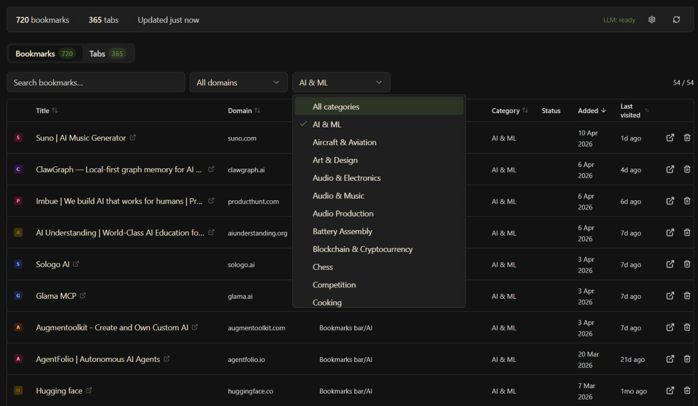
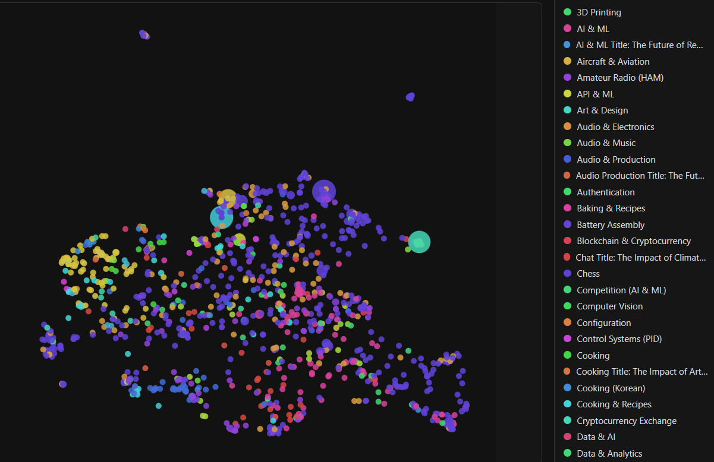
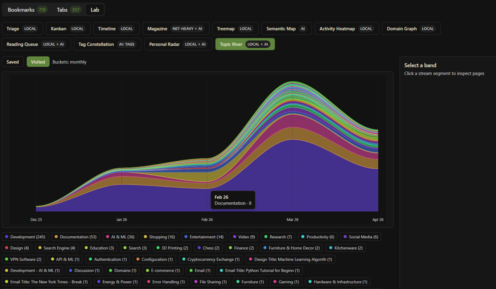
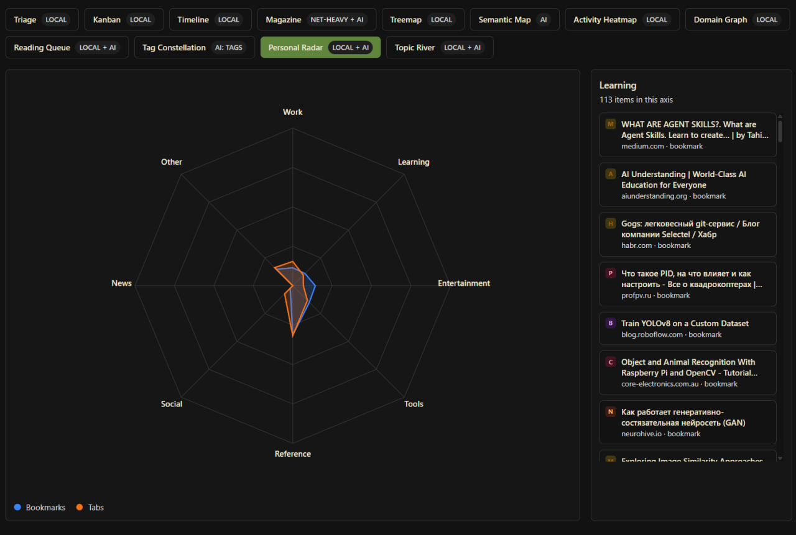
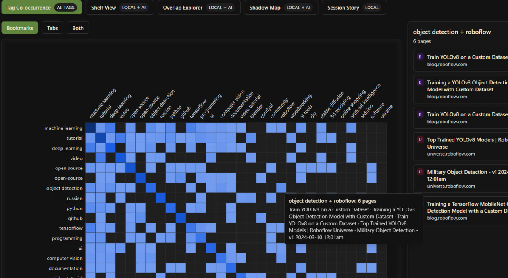

# TabLab

**Lab for bookmark hoarders**

A Chrome extension that turns your tabs and bookmarks into an analytics workspace. Local-first — all AI runs in the browser or on your machine, nothing leaves your device.

---

## Screenshots


*AI categorization — tabs and bookmarks classified by topic with intent labels*


*Semantic Map — 2D embedding projection clusters related pages automatically*


*Topic River — how your interests shift over time*


*Personal Radar — browsing pattern overview across categories*


*Tag Co-occurrence — discover connections between topics in your collection*

---

## What it does

TabLab enriches your browser data with AI and visualizes it in 18+ views:

| Category | Views |
|---|---|
| Organization | List, Kanban, Triage, Shelf |
| Exploration | Semantic Map, Tag Constellation, Domain Graph, Treemap |
| Time | Timeline, Activity Heatmap, Topic River, Session Story |
| Discovery | Magazine, Reading Queue, Focus Rings, Personal Radar |
| Analysis | Overlap Explorer, Shadow Map, Domain Drilldown, Tag Co-occurrence |

**AI enrichment (local, no cloud):**
- **Category** — classifies each tab/bookmark into a topic (Development, Finance, AI & ML, …)
- **Tags** — 3–5 topical tags per page for filtering
- **Intent** — how you use the page: `article`, `reference`, `tool`, `service`, `transactional`, `video`, `social`, `repository`
- **Embeddings** — semantic vectors for similarity search and 2D projection (Semantic Map)

---

## AI providers

Everything runs locally:

| Provider | Used for | Notes |
|---|---|---|
| **Gemini Nano** | Chat (classify/tag/intent) | Built into Chrome, no setup ** NOT WORKING YET **|
| **LM Studio** | Chat + Embeddings | Any OpenAI-compatible local server |
| **WebLLM** | Chat | WebGPU in-browser, no server needed |
| **Transformers.js** | Embeddings + Zero-shot NLI | ONNX/WASM, runs in offscreen document |

---

## Getting started

### Prerequisites

- Chrome 120+ (or any Chromium-based browser with extensions)
- Node.js 18+, pnpm

### Install & build

```bash
git clone https://github.com/aicrafted/tab-lab
cd tab-lab
pnpm install
pnpm build
```

### Load in Chrome

1. Open `chrome://extensions`
2. Enable **Developer mode**
3. Click **Load unpacked** → select the `dist/` folder

### Configure AI

Click the settings icon in the extension header. Options:

- **Gemini Nano** — enable in `chrome://flags/#optimization-guide-on-device-model` (no extra setup)
- **LM Studio** — run LM Studio with local server on `http://localhost:1234/v1`, pick a chat and embedding model
- **WebLLM** — select a model (e.g. `Qwen3-0.6B`), it downloads once and runs on WebGPU

---

## Development

```bash
pnpm dev        # watch mode — rebuilds on save
pnpm typecheck  # TypeScript check without emitting
```

After each build, reload the extension in `chrome://extensions` (click the refresh icon).

### Project structure

```
src/
  background/     Chrome service worker
  offscreen/      Transformers.js host (WASM inference, embeddings, NLI)
  lib/
    classifier.ts  Category classification
    intent.ts      Intent classification
    tagger.ts      Tag generation
    embedder.ts    Embedding fetch + 2D projection (UMAP)
    llm.ts         chatComplete() — routes to Gemini Nano / LM Studio / WebLLM
    webgpu-provider.ts  Offscreen messaging client
  components/
    views/         All 18+ view components
  pages/main/      Extension popup (React app)
```

---

## License

MIT — [github.com/aicrafted/tab-lab](https://github.com/aicrafted/tab-lab)

© 2025 AICrafted
